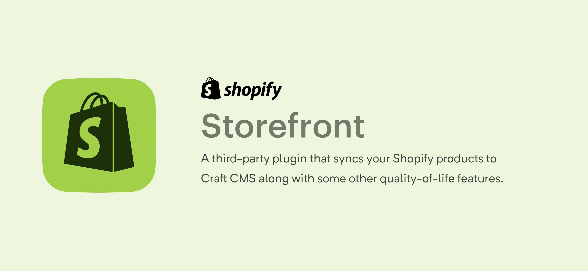

# Storefront

### TODO
- [ ] Create endpoints for the following webhooks:
  - [ ] Collection Create? / Update / Delete
  - [x] Product Create / Update / Delete
  - [x] Order Create
  - [x] Add utility to automatically add the webhooks (will need more API access)
- [x] Add manual sync utilities

#### MVP
- [x] Dynamically create / remove entries based on Shopify products (entries disabled by default)
- [ ] Dynamically create / remove categories based on Shopify collections (categories disabled by default)
- [x] Show a snippet of the product in a custom field in the entry (use this custom field to get shopify product data)
- [ ] Add twig tags / endpoints to show / update the Shopify "checkouts" (carts)
- [ ] Tie craft users to Shopify customers (SSO?)

#### Nice to have
- [ ] Allow basic editing of Shopify products in craft (i.e. title)
- [ ] Widgets showing various sales metrics
- [ ] Store some product info to allow for in-craft filtering

## Usage

- Create Shopify private app
- Enable Storefront API
- "Products, variants and collections" Read / Write access
- "Orders, transactions and fulfillments" Read / Write access